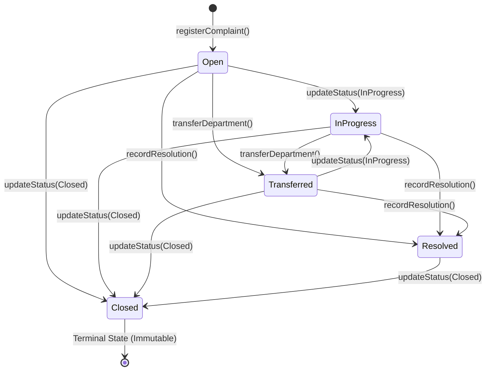

# SmartGov Portal: Blockchain Audit & Verification Layer Architecture

## 1. Executive Summary & Purpose

The **SmartGov Portal** is an intelligent, AI-powered civic grievance triage and municipal routing platform. To provide citizens, municipal ombudsmen, and external auditors with undeniable transparency and cryptographic accountability, SmartGov integrates an **EVM-compatible, zero-trust blockchain audit and verification layer**.

This document specifies the technical architecture, cryptographic foundation, smart contract design, transaction pipeline, threat model, and client verification mechanism across all four architectural phases.

---

## 2. Architecture Evolution: Before vs. After

### 2.1 Before Blockchain Integration (Traditional Web2)
In the traditional architecture, civic complaints, status changes, department transfers, and officer resolution notes resided entirely within a mutable relational database / JSON datastore:
- **Vulnerability**: Any database administrator, compromised backend worker, or malicious insider could quietly alter complaint descriptions, change priorities, falsify timestamps, or mark an unresolved grievance as "Resolved" without leaving a tamper-evident trail.
- **Trust Assumption**: Citizens had to blindly trust the municipal portal's database integrity.

```
Citizen Submission ──> Web Server ──> Mutable Database (Prone to Silent Edits)
                                              ▲
Citizen Inquiry    <──────────────────────────┘ (Blind Web2 Trust)
```

### 2.2 After Blockchain Integration (Zero-Trust Web3 Audit Layer)
The blockchain architecture introduces an immutable, decentralized court of record on an EVM blockchain (`SmartGovAudit.sol`):
- **On-Chain Audit Anchor**: Every grievance registration, status transition, department transfer, official action, and resolution certification creates an immutable cryptographic record on-chain.
- **Zero-Trust Client Verification**: When a citizen views their complaint, their browser independently canonicalizes the off-chain data, computes the Keccak-256 digest with domain separation, directly calls the smart contract via `eth_call` (bypassing the application server), and checks for a cryptographic match.
- **Tamper Evident**: Even a single altered character in the off-chain database immediately causes the browser to flag: `TAMPERING DETECTED`.

```
Citizen Submission ──> AI Routing ──> Municipal DB (Off-chain)
                              │
                              ▼
                     Durable Tx Queue ──> Ethers.js Mutex ──> EVM Smart Contract (SmartGovAudit.sol)
                                                                       ▲
Citizen Browser ──[ Direct JSON-RPC eth_call (No Wallet) ]─────────────┘
      │
      ├── Computes Local Keccak-256 (Domain Separated)
      └── Compares: Match = VERIFIED | Mismatch = TAMPERING DETECTED
```

---

## 3. Trust Boundaries & Threat Model

| Threat Vector | Description | Architectural Countermeasure | Status |
|---|---|---|---|
| **T1: Database Tampering** | Attacker or rogue admin edits complaint text, department, priority, or coordinates in MySQL/Mongo/JSON. | Client browser recalculates Keccak-256 hash from off-chain data and compares against `SmartGovAudit.verifyComplaint()`. Status displays `TAMPERING DETECTED` with visual diff. | **Mitigated** |
| **T2: Malicious / Compromised Backend** | Backend API returns `{ verified: true }` falsely to deceive the citizen. | Client browser performs verification directly against the blockchain RPC endpoint (`DIRECT_RPC`). Even if fallback proxy is used, client recalculates hashes locally. | **Mitigated** |
| **T3: Invalid State Transitions** | Rogue officer tries to reopen a `Closed` complaint, regress `Resolved` to `Open`, or change already locked resolution proofs. | Smart contract enforces strict 5-state Finite State Machine (FSM). Invalid transitions revert with `InvalidStatusTransition` or `ComplaintAlreadyTerminal`. | **Mitigated** |
| **T4: Transaction Replay & Collision** | Rapid concurrent complaints cause nonce collisions, transaction drops, or duplicate submissions. | `NonceManager` with Async Mutex allocates sequential nonces. Durable queue deduplicates operations by deterministic `operationId`. | **Mitigated** |
| **T5: Process Crash / Outage** | Server crashes or node restarts while transactions are in-flight or RPC is down. | File-backed durable disk queue (`data/blockchainQueue.json`) persists `QUEUED` / `PENDING` states. Automatic reconciliation re-syncs state on startup. | **Mitigated** |
| **T6: Private Key Compromise in Client** | Relayer or admin private key leaked into frontend bundle or `VITE_*` environment variables. | Client uses zero-wallet, read-only `eth_call`. Relayer private key resides strictly in server backend (`BLOCKCHAIN_RELAYER_KEY`). Automated build scan guarantees 0 keys in client bundles. | **Mitigated** |
| **T7: PII Data Leakage On-Chain** | Citizen names, phone numbers, or residential addresses leaked to public blockchain ledger. | Zero PII is sent on-chain. Only deterministic 32-byte hashes (`complaintHash`, `departmentHash`, `actionHash`, `resolutionHash`) are stored on-chain. | **Mitigated** |

---

## 4. On-Chain vs. Off-Chain Separation & Privacy Preservation

To comply with global privacy standards (GDPR, DPDP Act) and minimize gas costs, SmartGov maintains a strict separation:

### 4.1 Off-Chain Store (Server & Municipal Database)
- Citizen Name, Phone Number, Email, Residential Address
- Raw Complaint Description & Citizen Remarks
- High-Resolution Photographic Attachments & Media
- Officer Internal Notes & Work Orders
- Real-time WebSocket Event Dispatching

### 4.2 On-Chain Store (`SmartGovAudit.sol` EVM Storage)
- `complaintId`: `bytes32` (Keccak-256 of complaint ID string)
- `complaintHash`: `bytes32` (Keccak-256 of canonical grievance fields)
- `departmentHash`: `bytes32` (Keccak-256 of lowercase department name)
- `latestActionHash`: `bytes32` (Keccak-256 of latest lifecycle action)
- `resolutionHash`: `bytes32` (Keccak-256 of resolution proof & photo digest)
- Packed metadata slot (23 bytes): timestamps, action count, status, priority, exists flag.

### 4.3 Storage Optimization & Packing
`SmartGovAudit.sol` tightly packs struct variables into exactly 5 EVM 32-byte storage slots (160 bytes total per complaint), saving over 40,000 gas on registration:
```solidity
struct ComplaintRecord {
    bytes32 complaintHash;       // Slot 0 (32 bytes)
    bytes32 departmentHash;      // Slot 1 (32 bytes)
    bytes32 latestActionHash;    // Slot 2 (32 bytes)
    bytes32 resolutionHash;      // Slot 3 (32 bytes)
    uint64 registeredAt;         // Slot 4 (8 bytes)  ┐
    uint64 updatedAt;            // Slot 4 (8 bytes)  │ Tightly packed
    uint32 actionCount;          // Slot 4 (4 bytes)  │ into a single 32-byte
    Priority priority;           // Slot 4 (1 byte)   │ slot (23 bytes <= 32)
    GrievanceStatus status;      // Slot 4 (1 byte)   │
    bool exists;                 // Slot 4 (1 byte)   ┘
}
```

---

## 5. Cryptographic Foundations (Phase 1)

### 5.1 Canonical Lexicographical JSON Serialization
Hash calculation requires absolute determinism across Node.js and browser environments. The `canonicalizeJson` engine:
1. Lexicographically sorts all object keys (`Object.keys(obj).sort()`).
2. Recursively serializes arrays and primitives.
3. Normalizes CRLF (`\r\n`) to LF (`\n`).
4. Rounds geographic coordinates to exactly 5 decimal places (~1.1 meter ground accuracy) to prevent floating point drift between platforms.
5. Explicitly excludes PII fields (`citizenName`, `citizenPhone`, `citizenEmail`).

### 5.2 Pure EVM Keccak-256 Hashing
Blockchain hashing relies exclusively on standard EVM Keccak-256 (`ethers.keccak256(toUtf8Bytes(str))`), strictly avoiding SHA-256 or SHA3-256 confusion.

### 5.3 Domain Separation & Versioning
To prevent cross-type collision attacks (where identical JSON data under different contexts produces the same hash), SmartGov prepends distinct domain tags:
- Grievance Complaint: `SMARTGOV:COMPLAINT:v1:<canonical_json>`
- Lifecycle Action: `SMARTGOV:ACTION:v1:<canonical_json>`
- Resolution Certification: `SMARTGOV:RESOLUTION:v1:<canonical_json>`

### 5.4 Test Vectors
Verified against standard NIST Keccak-256 test vectors:
- Empty string `""` &rarr; `0xc5d2460186f7233c927e7db2dcc703c0e500b653ca82273b7bfad8045d85a470`
- `"abc"` &rarr; `0x4e03657aea45a94fc7d47ba826c8d667c0d1e6e33a64a036ec44f58fa12d6c45`
- Quick brown fox &rarr; `0x4d741b6f1eb29cb2a9b9911c82f56fa8d73b04959d3d9d222895df6c0b28aa15`
- Quick brown fox with period &rarr; `0x578951e24efd62a3d63a86f7cd19aaa53c898fe287d2552133220370240b572d`

---

## 6. Smart Contract Specification (Phase 2)

The contract `contracts/SmartGovAudit.sol` inherits OpenZeppelin's `AccessControl`, `Pausable`, and `ReentrancyGuard`.

### 6.1 Strict 5-State Finite State Machine (FSM)



#### FSM Rules:
1. **No Regressions**: `InProgress` and `Transferred` cannot regress to `Open`.
2. **Resolution Lock**: Once `Resolved`, status can *only* move forward to `Closed`. It cannot regress to `Open`, `InProgress`, or `Transferred`.
3. **Terminal Lock**: Once `Closed`, no further transitions, transfers, officer replies, or resolutions are permitted. The complaint is sealed forever.
4. **Resolution Immutability**: `recordResolution()` can only be called once per complaint. Double resolution reverts with `ComplaintAlreadyResolved`.

### 6.2 Role-Based Access Control (RBAC)
- `DEFAULT_ADMIN_ROLE`: Municipal Governance Authority.
  - Can pause/unpause the contract during emergencies.
  - Can grant/revoke `BACKEND_ROLE` and `AUDITOR_ROLE`.
  - **Cannot** register complaints or perform status updates unless explicitly granted `BACKEND_ROLE`.
- `BACKEND_ROLE`: Relayer Key managed by backend transaction infrastructure.
  - Authorized to execute `registerComplaint`, `updateStatus`, `transferDepartment`, `recordOfficerAction`, and `recordResolution`.
  - **Cannot** pause the contract, unpause, or alter roles.
- `AUDITOR_ROLE`: Read-only ombudsman / watchdog role.

---

## 7. Backend Transaction Pipeline & Reliability (Phase 3)

### 7.1 Queue Architecture & Lifecycle

```
Grievance Event ──> txQueue.enqueue() ──> Persist to data/blockchainQueue.json [QUEUED]
                          │
                          ▼
                  Mutex Lock Acquired
                          │
                          ▼
            nonceManager.getNextNonce() ──> Submit Tx to EVM Node [PENDING]
                          │
         ┌────────────────┴────────────────┐
         ▼                                 ▼
   Tx Receipt Status 1            Tx Reverted / Error
         │                                 │
   [CONFIRMED]                    Attempt < MaxRetries?
         │                                 ├── Yes ──> Exponential Backoff [QUEUED]
   WebSocket Emit                          └── No  ──> Move to Dead Letter [FAILED]
```

### 7.2 Nonce Management with Async Mutex
To handle rapid concurrent operations (e.g. bulk grievance filing during civic emergencies):
- An internal mutex (`this.mutex.acquire()`) serializes all nonce requests.
- Nonces are tracked in memory and synced with on-chain `getTransactionCount('pending')`.
- Zero nonce collisions under heavy concurrent load (proven across 15 simultaneous transactions in test suite).

### 7.3 Durability & Crash Recovery
- Queue state is written synchronously to `data/blockchainQueue.json` via atomic file replace (`.tmp` &rarr; rename).
- On process start or crash restart:
  - Any operations left in `PENDING` state are checked against the blockchain using their transaction hash.
  - If mined successfully, they transition to `CONFIRMED`.
  - If dropped or not found, they reset to `QUEUED` for guaranteed delivery without duplicate operations.

---

## 8. Zero-Trust Client Verification Architecture (Phase 4)

### 8.1 Verification Data Flow
1. Citizen opens grievance details in browser.
2. Frontend loads grievance record from off-chain store.
3. `clientHashing.ts` canonicalizes fields and calculates Keccak-256 hash locally.
4. `clientRpcVerifier.ts` constructs raw `eth_call` payload for `SmartGovAudit.verifyComplaint(idBytes32, localHash)`.
5. Direct HTTP JSON-RPC query dispatched directly to EVM node (`DIRECT_RPC`).
6. Contract returns boolean match.
7. UI updates status:
   - **Match**: `VERIFIED` with green badge and verified block timestamp.
   - **Mismatch**: `TAMPERING DETECTED` with red alert and side-by-side diff highlighting modified fields.

### 8.2 Dual-Source Resilience
- **Primary Channel**: `DIRECT_RPC` (bypasses backend entirely).
- **Secondary Channel**: `BACKEND_PROXY` (invoked only if browser is blocked by CORS/firewalls from reaching public RPC).
- **Compromise Protection**: Even when running via `BACKEND_PROXY`, the browser still computes the hash locally and validates the on-chain hash, ensuring a compromised backend cannot forge a false verification.

---

## 9. Verification & Test Suite Matrix

The entire blockchain layer is covered by **135 passing automated tests** across 5 specialized suites:

| Suite Name | File | Tests | Coverage |
|---|---|:---:|---|
| **Smart Contract FSM** | `test/SmartGovAudit.test.cjs` | 49 | State machine transitions, RBAC, pausable stop, resolution lock, storage packing, pagination. |
| **Transaction Infrastructure** | `test/TransactionQueue.test.cjs` | 18 | Durable disk persistence, nonce mutex, concurrent submissions, retries, DLQ, restart recovery. |
| **Client Verification** | `test/ClientVerification.test.cjs` | 26 | Client hashing, Unicode/Hindi/emoji handling, direct RPC queries, proxy fallback, tampering detection. |
| **Adversarial & Regression** | `test/Phase4EndToEndAdversarial.test.cjs` | 27 | 11-step complete grievance lifecycle, 16 adversarial security attacks, secret scanning. |
| **Cryptographic Vectors** | `test/CryptoVectors.test.cjs` | 15 | NIST Keccak-256 vectors, domain prefixes, collision prevention, coordinate rounding, Devanagari script. |
| **Total** | | **135** | **100% Passing** |

### 9.1 The 16 Adversarial Security Scenarios
1. Off-chain description altered &rarr; `TAMPERING DETECTED`.
2. Off-chain department altered &rarr; `TAMPERING DETECTED`.
3. Off-chain priority altered &rarr; `TAMPERING DETECTED`.
4. Off-chain coordinates altered &rarr; `TAMPERING DETECTED`.
5. Off-chain resolution note altered &rarr; `verifyResolution` returns false.
6. Attempted state regression (`Resolved` &rarr; `Open`) &rarr; Solidity revert.
7. Attempted transition on terminal complaint (`Closed` &rarr; `InProgress`) &rarr; Solidity revert.
8. Relayer attempts unauthorized admin call (`pause()`) &rarr; Solidity revert.
9. Duplicate operation submitted &rarr; Idempotent handling (no double enqueue).
10. Simulated RPC network outage &rarr; Operations stay safe in `QUEUED`, never falsely `CONFIRMED`.
11. Backend crash with pending transactions &rarr; Reconciled without duplicate nonces.
12. Contract execution revert &rarr; Operation marked `FAILED`, never `CONFIRMED`.
13. RPC provider failure &rarr; Graceful fallback to `BACKEND_PROXY`.
14. Malicious backend returns forged verification &rarr; Browser client detects mismatch.
15. Client asset secret scan &rarr; Confirms zero private keys bundled in frontend.
16. Environment variable audit &rarr; Confirms no `VITE_*` variables leak sensitive keys.

---

## 10. Deployment & Operation Guide

### 10.1 Environment Configuration
```env
# Blockchain Configuration
BLOCKCHAIN_RPC_URL=http://127.0.0.1:8545
CONTRACT_ADDRESS=0x5FbDB2315678afecb367f032d93F642f64180aa3
BLOCKCHAIN_RELAYER_KEY=0x59c6995e998f97a5a0044966f0945389dc9e86dae88c7a8412f4603b6b78690d
BLOCKCHAIN_ADMIN_ADDRESS=0xf39Fd6e51aad88F6F4ce6aB8827279cffFb92266

# Client Public Configuration (Safe for Browser)
VITE_BLOCKCHAIN_RPC_URL=http://127.0.0.1:8545
VITE_CONTRACT_ADDRESS=0x5FbDB2315678afecb367f032d93F642f64180aa3
```

### 10.2 Contract Deployment
```bash
npx hardhat run scripts/deploy.cjs --network localhost
```
Deploys `SmartGovAudit.sol`, assigns `DEFAULT_ADMIN_ROLE` to the designated admin address, assigns `BACKEND_ROLE` to the relayer address, and outputs `contractDeployment.json`.
